# Visualisation of Traffic Flows
Juan P. Fonseca-Zamora

``` r
options(repos = c(CRAN = "https://cloud.r-project.org"))
if (!require("remotes")) install.packages("remotes")
pkgs = c(
    "sf",
    "tidyverse",
    "tmap",
    "zonebuilder",
    "BAMMtools"
)
remotes::install_cran(pkgs)
sapply(pkgs, require, character.only = TRUE)
```

             sf   tidyverse        tmap zonebuilder   BAMMtools 
           TRUE        TRUE        TRUE        TRUE        TRUE 

## Loading the data

We will be using some traffic estimates for Edinburgh that where
produced with a GLM.

``` r
sf_net <- st_read("preliminary_traffic_estimates_edinburgh.gpkg")
```

    Reading layer `preliminary_traffic_estimates_edinburgh' from data source 
      `C:\Users\ts18jpf\OneDrive - University of Leeds\03_PhD\00_Misc_projects\netvis-trafficflows\preliminary_traffic_estimates_edinburgh.gpkg' 
      using driver `GPKG'
    Simple feature collection with 58592 features and 18 fields
    Geometry type: LINESTRING
    Dimension:     XY
    Bounding box:  xmin: 289184 ymin: 637185.4 xmax: 365020.9 ymax: 717199.1
    Projected CRS: OSGB36 / British National Grid

``` r
plot(sf_net["geom"])
```

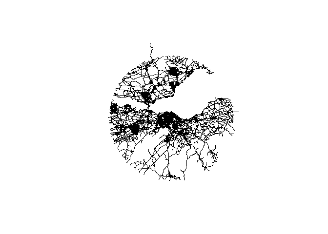

Let’s clip the `sf` using the `zonebuilder` package

``` r
bounds <- zb_zone("Edinburgh",n_circles = 4) |> st_transform(27700)

edinburgh_AADT <- sf_net[bounds,]

plot(edinburgh_AADT["geom"])
```

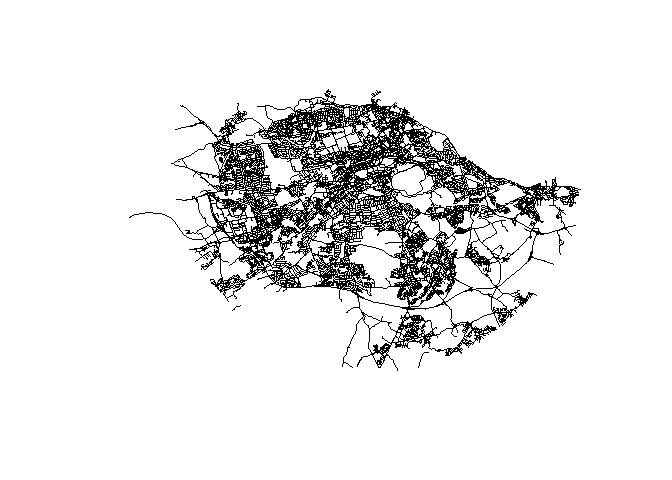

## Plotting the traffic flows

Let’s use base R to plot the traffic flows

``` r
plot(edinburgh_AADT["pred_flows"])
```

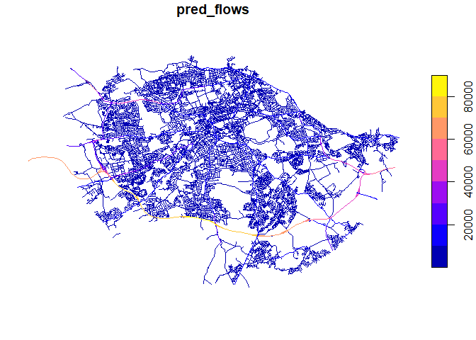

By using `tmap` or `ggplot` we can easily manipulate some of the
elements of the visualisation

``` r
ggplot(edinburgh_AADT)+
  geom_sf(aes(col = pred_flows))
```

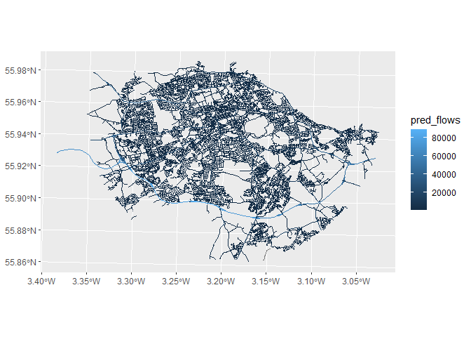

Let’s eliminate the background

``` r
ggplot(edinburgh_AADT)+
  geom_sf(aes(col = pred_flows))+
  theme_void()
```

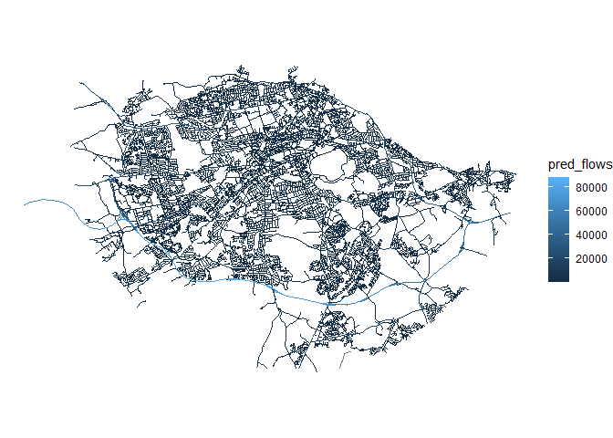

We can use a binned scale for the flows

``` r
ggplot(edinburgh_AADT)+
  geom_sf(aes(col = pred_flows))+
  theme_void()+
  scale_color_binned()
```


We can also use a different palette

``` r
ggplot(edinburgh_AADT)+
  geom_sf(aes(col = pred_flows))+
  theme_void()+
  scale_color_binned(type = "viridis")
```

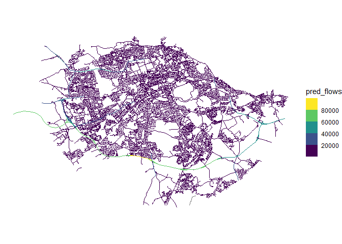

Let’s use some other attributes of the network to improve the visuals.
For example, the road hierarchy to show the relative importance of the
road in the network. High volumes are expected to be present on major
roads.

``` r
edinburgh_AADT |> pull(road_classification) |> unique()
```

    [1] "Unclassified"          "Classified Unnumbered" "Not Classified"       
    [4] "Unknown"               "B Road"                "A Road"               
    [7] "Motorway"             

We can create a factor for the road classification and use it to modify
the line width

``` r
roadclass_levels <- c("Not Classified",
                      "Unclassified",
                      "Unknown",
                      "Classified Unnumbered",
                      "B Road",
                      "A Road",
                      "Motorway") 

edinburgh_AADT |> 
  mutate(road_classification = factor(road_classification,
                                      levels = roadclass_levels,
                                      ordered = T)) |> 
  ggplot()+
  geom_sf(aes(col = pred_flows,linewidth = road_classification))+
  theme_void()+
  scale_color_binned(type = "viridis")
```

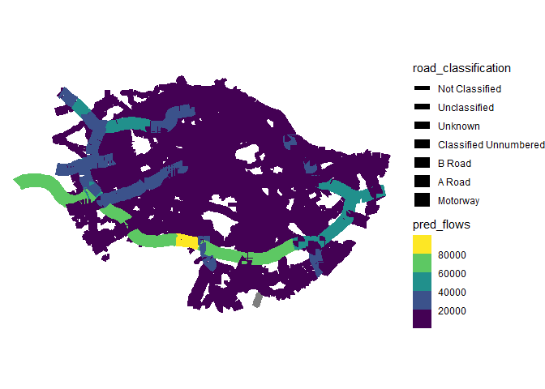

Improving the definition of the line-width scale

``` r
edinburgh_AADT |> 
  mutate(road_classification = factor(road_classification,
                                      levels = roadclass_levels,
                                      ordered = T)) |> 
  ggplot()+
  geom_sf(aes(col = pred_flows,linewidth = road_classification))+
  theme_void()+
  scale_color_binned(type = "viridis")+
  scale_linewidth_manual(values = 2*c(0.1,0.15,0.2,0.25,0.3,0.4,0.6))
```

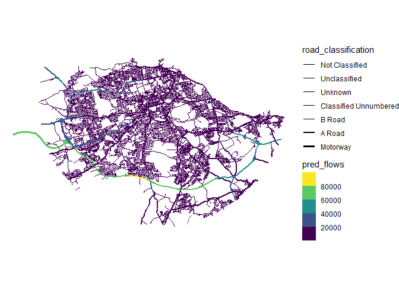

We can play with the `alpha` too

``` r
edinburgh_AADT |> 
  mutate(road_classification = factor(road_classification,
                                      levels = roadclass_levels,
                                      ordered = T)) |> 
  ggplot()+
  geom_sf(aes(col = pred_flows,
              linewidth = road_classification,
              alpha = road_classification))+
  theme_void()+
  scale_color_binned(type = "viridis",)+
  scale_linewidth_manual(values = 2*c(0.1,0.15,0.2,0.25,0.3,0.4,0.6))
```

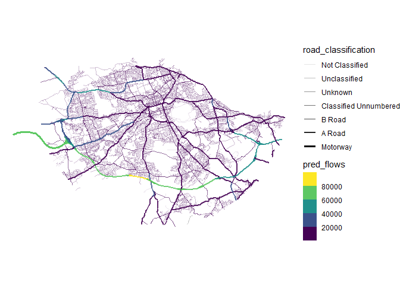

The binning for the flows can be improved. Let’s try exploring the
distribution of the values and defining breaks for the quantiles

``` r
edinburgh_AADT |> 
  ggplot(aes(pred_flows))+
  geom_histogram(bins = 50)
```

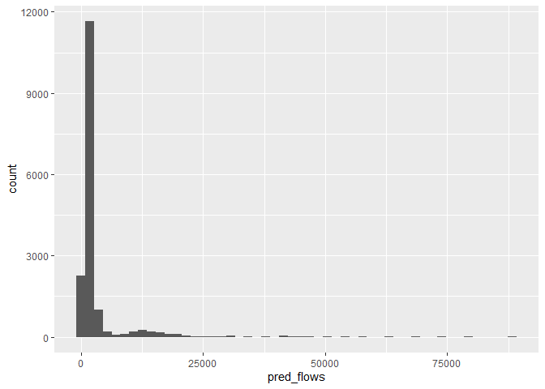

``` r
breaks = c(0,1000,2000,5000,10000,25e3,1e5)

cols <- viridis::viridis(6)


edinburgh_AADT |> 
  mutate(road_classification = factor(road_classification,
                                      levels = roadclass_levels,
                                      ordered = T)) |> 
  ggplot()+
  geom_sf(aes(col = pred_flows,
              linewidth = road_classification,
              alpha = road_classification))+
  theme_void()+
  scale_color_stepsn(colours = cols,
                     breaks = breaks,
                     values = scales::rescale(breaks,to = c(0, 1)))+
  scale_linewidth_manual(values = 2.5*c(0.1,0.15,0.2,0.25,0.3,0.4,0.5))+
  scale_alpha_manual(values = c(0.1,0.3,0.45,0.5,0.6,0.8,1))
```

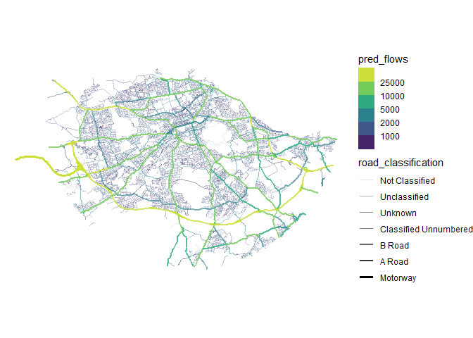

## To consider

- directed networks are trickier (overlapping edges/links)
- …
